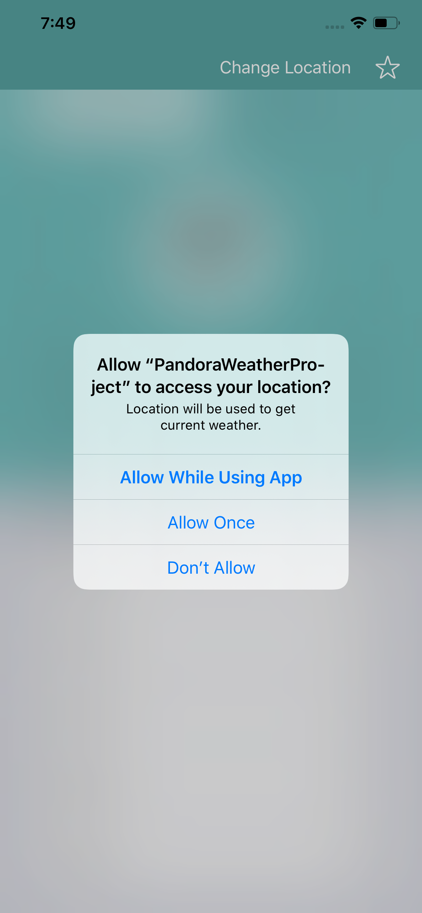
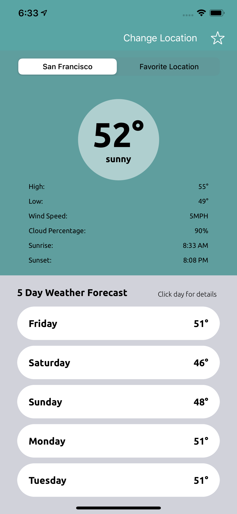
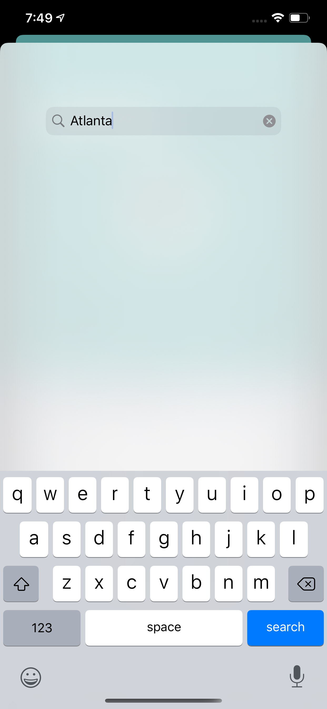
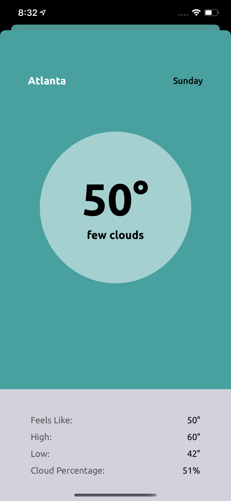
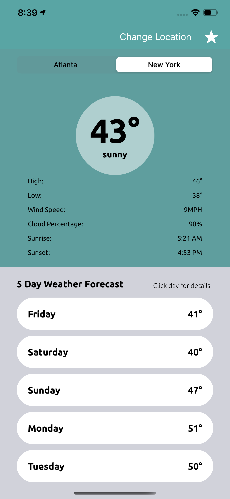

# PandoraProject
This is a project used to display my proficiency in iOS development.

A description of the overall iOS application
A high level architectural overview of your iOS application. e.g. names, relationships and purposes of all UIViewControllers and UIViews
Explanations for and descriptions of the design patterns you leveraged
Screenshots of each View and descriptions of the overall user flow

Here, we have a simple weather app using the openweathermap.org api. With this app, you see weather by your current location upon launch. You can also search for a location by city name as well as set a favorite location. 

 

As a user you will be prompted by a location request, and once granted access given the weather for the current location.

 

You will then be allowed to change locations by searching another city by name.

 

You can see the details for each forecasted day.

 

Finally, you can select a favortie city that will persist between uses.

There are three view controllers:

The main view controller (CurrentWeatherViewController) contains two main UIViews, one housing the current weather, and the other housing the five day forecast. On the current weather view there is a UIView that displays the current temperature/weather description stack view. In the five daye forecast UIView there are five different views (one for each day) that have tap gesture recognizers to allow segue to the forecasted weather day detail view. 

Next, we have the search view conttroller (SearchViewController) it is equipped with a visual effects blur UIView and a search bar. The goal here was to have some transparency between the views for a better visual experience. 

Lastly, we have out detail view controller (ForecastedWeatherDayViewController) with two UIViews similar to our main view. One view has the current temperature, day, and location, and the other displays multiple temperature properties and a cloud percentage for that specific location.

This application was written using an MVVM arechetecture, all views are populated using a view model or array of view model objects updated per network call. All models conform to codeable for proper JSON serializationa and deserialization.
